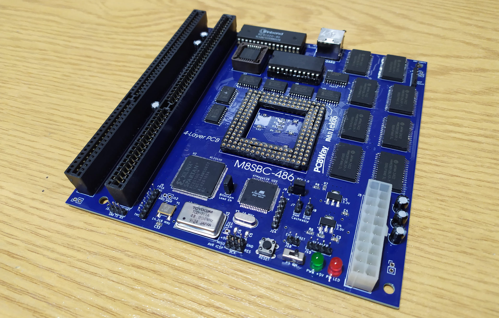
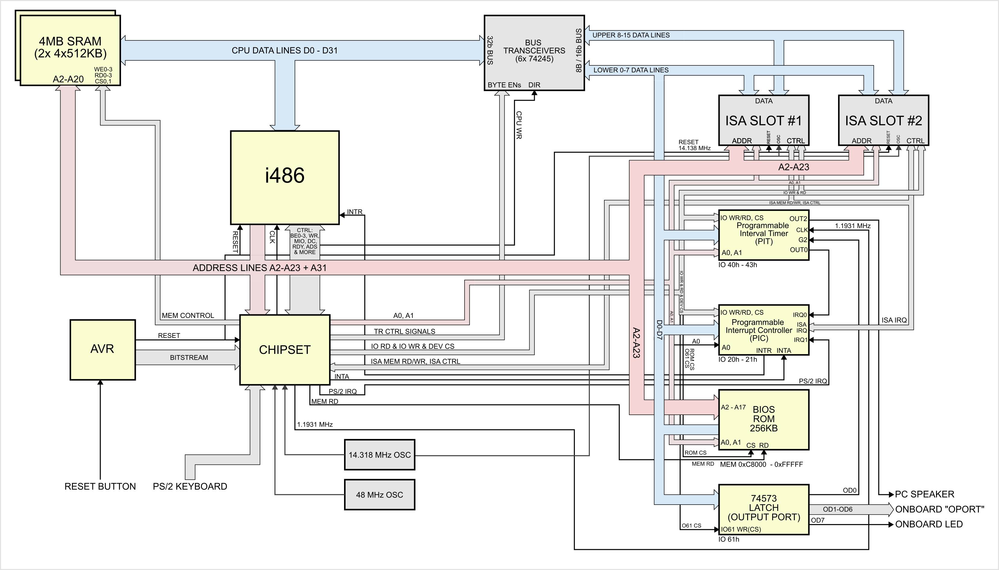
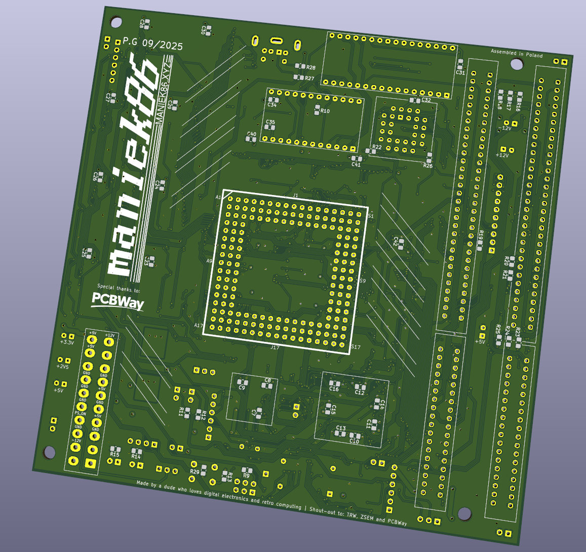
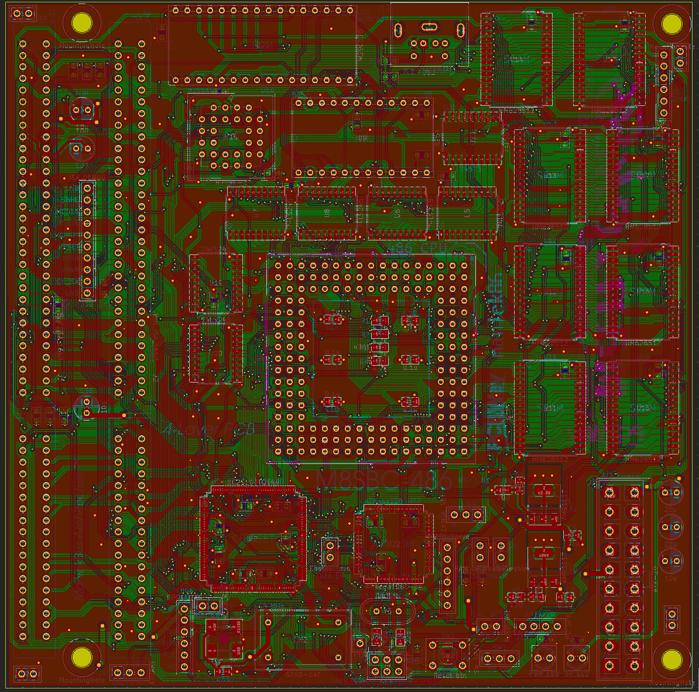

# M8SBC-486

All the sources (Schematics, PCB, VHDL, BIOS sources) for the M8SBC-486. 

This project is a 486 Homebrew computer, with some efforts to make it kinda PC compatible

## Specs:

- 5V 486 CPU socket
- Xilinx Spartan II XC2S100 FPGA as "chipset". Codename "Hamster 1"
- 4MB SRAM, (8*HM628512)
- 256KB of ROM (W29C020)
- Two 16-bit ISA slots
- 8254 Programmable Interval Timer
- 8259 Programmable Interrupt controller
- PS/2 Keyboard
- ATMega128 as reset circuit handler and bitstream loader
- 150*150mm 4 layer PCB

The FSB frequency is currently set to a fixed 24 MHz, but this can be changed by uncommenting/commenting lines in the FPGA source.

Secondary PIC and DMA are missing, so the compatibility is not full. The missing DMA especially breaks support for sound cards.

## Current progress:

The hardware and FPGA are mostly done. BIOS is in WIP. There are a few issues & bugs, but they are being slowly fixed.

Among the most impressive things the board (as time of writing: 26/12/2025) is capable of: 

- Booting Linux (2.2.26) (using custom bootloader, release TODO)

- Booting MS-DOS and FreeDOS: The software compatibility is mixed. Some software hangs the system, throws exceptions, but some run fine. Most notable are: Second Reality demo (no sound, small glitches at two parts), Prince of Persia, Fasttracker II (PC speaker works in one mode, LPT DAC works okay), 3DBench 1.0c, CACHEHK.

## Hardware diagram

## Special thanks to [PCBWay](https://www.pcbway.com)!

Special thanks to PCBWay for sponsoring PCBs for this project! Their sponsorship was a huge help and enabled me to make progress with this project. PCBWay is a well-known PCB prototyping and manufacturing service, providing high-quality boards and excellent customer support. I have worked with their boards in the past and can say that they are of great quality. I easily placed an order for PCBs on their platform for this project without any problems. The sponsorship also included a free quick delivery option. If you’re looking for reliable PCB prototyping and manufacturing services, I highly recommend [checking them](https://www.pcbway.com).

# Folders

## pcb/

Schematic and PCB design for this homebrew computer. Board is 150mm*150mm with 4 layers. (Placement of the screw holes is not compliant with any standard)

## chipset/

Sources for the "Hamster 1" chipset. FPGA used is XC2S100 (Xilinx Spartan II). Compile with Xilinx ISE 10.1

## avr/

Sources for AVR ATMega128:

Small AVR firmware that configures the FPGA from on-chip flash at power-up and manages system reset for the M8SBC-486 project

## Disclaimer

This project is essentially my hobby, as I like retro, electronics, digital circuits and low-level programming. I never expected this computer to run DOS in the first place. I consider it pretty much experimental and made to research the workings of older x86 chips. I am pretty sure that this work could be used to build something more robust and stable or even to develop fully custom-made boards for other x86 CPUs.

## Acknowledgements

Special thanks to: TheRetroWeb community, [b-dmitry1](https://github.com/b-dmitry1) and [PCBWay](https://pcbway.com/)

## More images

